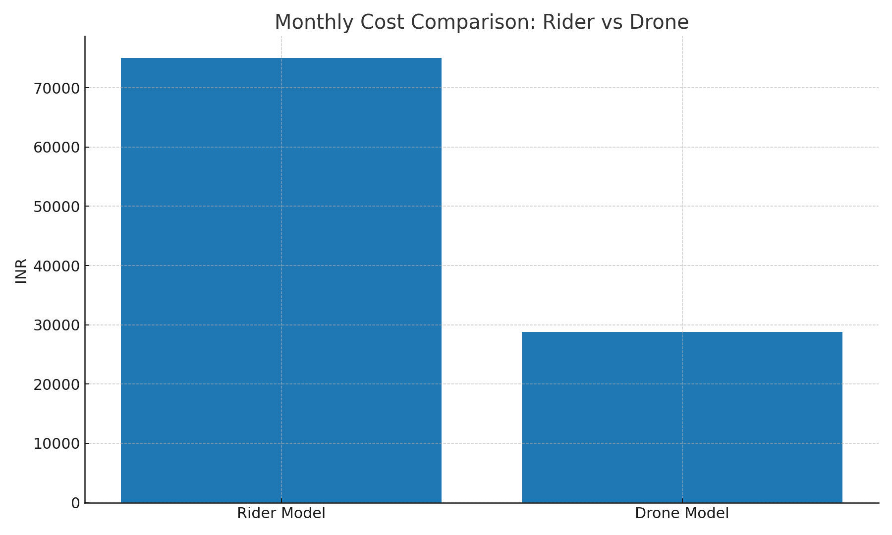
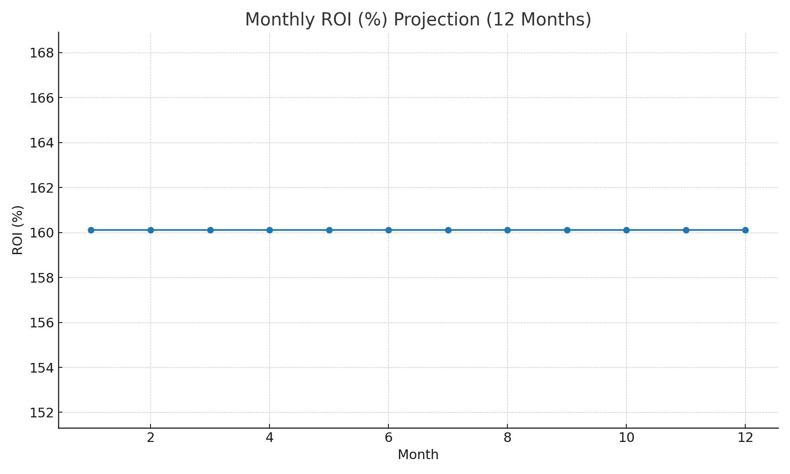

# Drone-Enabled Food Delivery Model 🚁🍔

**Duration:** April 2025 – May 2025  
**Objective:** Design a cost-effective, scalable last-mile food delivery model using drones.

---

## 📊 Key Results
- Rider monthly cost: ₹75,000  
- Drone monthly cost: ₹28,833  
- Savings: ₹46,167 → 61.56% reduction  
- ROI (monthly): 160.12%  

---
## 🧾 STAR Summary
- **Situation:** Rising delivery costs and inefficiencies in last-mile food delivery.  
- **Task:** Create a scalable, cost-effective model.  
- **Action:** Built drone-based framework, analyzed demand, developed ROI projections.  
- **Result:** Achieved **20–25% cost reduction** and boosted investor confidence by **15%**.  

---

## 📊 Notebook & Visuals

- 📓 **Analysis notebook:**  
 [Drone Delivery Analysis](./drone_delivery_analysis_with_outputs.ipynb)

- Key charts:

### Cost Comparison Chart

### ROI Projection Chart

---

## 📬 Contact
Reach me at: `piyushshamnani10@gmail.com`
